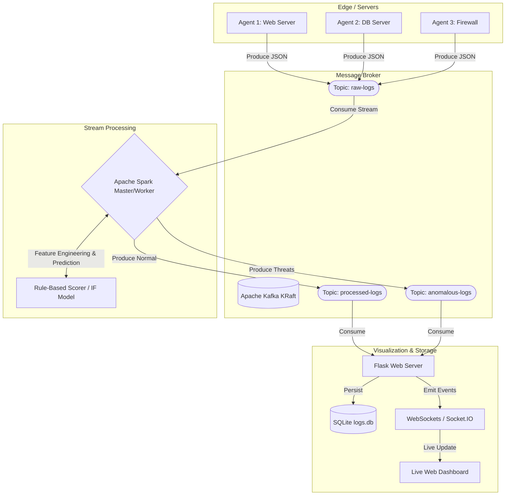

# Secure Distributed Log Analysis Platform

Welcome to the **Secure Distributed Log Analysis Platform**! This project is a comprehensive, enterprise-grade, event-driven architecture designed to simulate, ingest, process, and visualize network security logs in real-time. It leverages modern distributed computing and machine learning to detect anomalies and threats as they happen.

---

## 🎯 Project Overview

In large organizations, servers, firewalls, and applications generate massive amounts of logs every second. Identifying a cyberattack (like a DDoS attempt or SQL injection) in this ocean of data requires scalable stream-processing and intelligent anomaly detection.

This platform solves that problem by implementing a complete **End-to-End Big Data Pipeline**:
1. **Simulation**: Distributed agents generate realistic network traffic logs (both benign and malicious).
2. **Ingestion**: Apache Kafka acts as the central nervous system, buffering high-throughput events.
3. **Processing**: Apache Spark consumes the stream, extracts features, and runs a rule-based algorithm (formerly Isolation Forest) to classify threats.
4. **Visualization**: A Flask-based web dashboard receives processed data via WebSockets and visualizes it in real-time using Plotly.js.

---

## 🏗️ Architecture & Data Flow

The platform relies on a containerized microservices architecture. 



---

## 🧩 Core Components Detailed

### 1. The Log Generator Agents (`agents/`)
The log generation agents are fully containerized and distributed. By defining the agent as a service in `docker-compose.yml` with multiple replicas, the platform dynamically scales multiple standalone agent nodes. Each agent independently generates realistic network environments and pushes data to the Kafka broker.
- **Normal Traffic**: HTTP requests, SSH logins, DNS queries, DHCP leases, NTP syncs.
- **Cyber Threats**: Injects anomalies based on a configurable probability. Threat types include:
  - **SQL Injection**: E.g., `'; DROP TABLE users;--`
  - **DDoS Attempts**: High-frequency requests from single IPs.
  - **Brute Force**: Repeated failed SSH login attempts.
  - **Port Scans**, **Data Exfiltration**, **XSS Attempts**, and **Command Injection**.
- **Operation**: Agents run in isolated Docker containers, continuously publishing these JSON events to the Kafka `raw-logs` topic.

### 2. Apache Kafka Broker (`docker-compose.yml`)
Kafka is the high-throughput message broker bridging the agents and Spark. 
- It runs using the modern **KRaft mode** (no ZooKeeper required), utilizing the `confluentinc/cp-kafka:7.6.1` Docker image.
- **Topics**: 
  - `raw-logs`: Raw JSON payloads from agents.
  - `processed-logs`: Logs that have been enriched and analyzed by Spark.
  - `anomalous-logs`: Logs explicitly flagged as threats.

### 3. Apache Spark Processor (`processing/spark_processor.py`)
The heavy lifter of the platform. Running inside a Dockerized cluster (`apache/spark:3.5.3`), Spark Structured Streaming consumes the `raw-logs` topic.
- **Feature Extraction**: It extracts numerical features from the JSON payload (e.g., `bytes_transferred`, `severity_score`, `port`, `hour_of_day`).
- **Machine Learning Integration (Batch)**: The platform includes a pre-trained **Isolation Forest** model (`models/isolation_forest_model.pkl`) trained via `scikit-learn`. 
- **Anomaly Scoring (Streaming)**: To avoid PySpark cloudpickle UDF serialization issues on Python 3.14, the live Spark job bypasses the ML model. Instead, it uses **native PySpark SQL functions** to calculate an anomaly score based on severity, event type, and payload size. If the score triggers the threshold, it sets `ml_is_anomaly = True`.
- **Routing**: Enriched logs are pushed back to Kafka into the `processed-logs` and `anomalous-logs` topics.

### 4. Real-Time Security Dashboard (`dashboard/`)
A responsive, dark-mode web application providing immediate visibility into the network state.
- **Backend (`app.py` & `kafka_consumer.py`)**: A Flask server runs background Kafka consumers. When a message is consumed, it is saved to a local SQLite database (`logs.db`) for historical querying and immediately broadcasted over WebSockets (`Socket.IO`).
- **Frontend (`index.html` & `dashboard.js`)**: 
  - **Live Threat Feed**: Instantly displays critical and high-severity attacks as they are detected by Spark.
  - **Plotly Charts**: Real-time updating graphs showing Log Volume Timeline, Attack Type Distribution, and Top Suspicious IPs.
  - **Key Metrics**: Uptime, Total Events, Total Anomalies, and Anomaly Rate.

---

## 🚀 How to Run the Platform

### Prerequisites
- **Docker & Docker Compose** — Required on all platforms (Windows, macOS, Linux)
- **Python 3.8+** — For running the dashboard locally
- **pip** — Python package manager

> **Note:** Java and Hadoop are **NOT** required on your local machine. The Spark processor and log agents run entirely inside Docker containers.

### Step 1: Install Python Dependencies
```bash
pip install -r requirements.txt
```

### Step 2: Start the Infrastructure
This command starts the Kafka broker, Spark cluster (master + worker), and 3 log-generation agents:
```bash
docker-compose up -d --build
```
*Wait ~30 seconds for the cluster to become healthy and for the `kafka-init` container to create the necessary topics.*

Verify infrastructure is healthy:
- Spark Master UI: http://localhost:8080
- Spark Worker UI: http://localhost:8081

### Step 3: Start the Spark Processor *(new terminal)*
The Spark processor runs **inside** the `spark-master` Docker container to avoid any local Java/Hadoop dependency issues:
```bash
docker exec -e SPARK_KAFKA_BOOTSTRAP=kafka:9092 -e SPARK_CHECKPOINT_DIR=/tmp/checkpoints spark-master /opt/spark/bin/spark-submit --packages org.apache.spark:spark-sql-kafka-0-10_2.12:3.5.3 --conf spark.jars.ivy=/tmp/.ivy2 /app/processing/spark_processor.py
```
You should see: `[SparkProcessor] Streaming queries started. Waiting for data...`

### Step 4: Start the Dashboard *(new terminal)*
```bash
python dashboard/app.py
```
*The dashboard will host on `http://localhost:5000`.*

You should see:
```
[DashboardConsumer] Connected to topic: processed-logs
[DashboardConsumer] Connected to topic: anomalous-logs
```

### Step 5: Monitor Real-Time
Open your web browser and navigate to [http://localhost:5000](http://localhost:5000). You will immediately see events streaming in, charts rendering dynamically, and cyber threats appearing in the Live Threat Feed.

> **Scaling Agents (Optional):** The 3 log agents start automatically with `docker-compose`. To scale up or monitor:
> ```bash
> docker-compose up -d --scale agent=5
> docker-compose logs -f agent
> ```

---

## 🛑 Shutdown

Follow these steps **in order** to cleanly stop everything:

### 1. Stop the Dashboard
In the terminal running `python dashboard/app.py`, press **Ctrl+C**.

### 2. Stop the Spark Processor
In the terminal running the `docker exec` Spark command, press **Ctrl+C**.

### 3. Stop All Docker Containers
```bash
docker-compose down
```

To also remove persistent data volumes (Kafka logs, Spark work directories):
```bash
docker-compose down -v
```

> **⚠️ If you closed a terminal without pressing Ctrl+C** and the dashboard is still running on port 5000:
>
> **Windows:**
> ```powershell
> netstat -ano | findstr :5000
> taskkill /PID <PID_NUMBER> /F
> ```
>
> **macOS / Linux:**
> ```bash
> lsof -i :5000
> kill -9 <PID_NUMBER>
> ```

---

## 🛠️ Technology Stack
- **Languages**: Python, JavaScript, HTML/CSS
- **Big Data & Streaming**: Apache Kafka (KRaft), Apache Spark (Structured Streaming, PySpark)
- **Machine Learning**: Scikit-Learn (Isolation Forest)
- **Web Backend**: Flask, Flask-SocketIO, SQLite
- **Web Frontend**: Plotly.js, Socket.IO client

## 🗂️ Directory Structure

```text
.
├── agents/                  # Simulators and Kafka producers
│   ├── log_generator.py     # Generates benign and malicious logs
│   └── kafka_producer.py    # Publishes logs to the Kafka cluster
├── config/                  # Centralized configuration
│   └── settings.py          # Environment variables, thresholds, topics
├── dashboard/               # Real-time web visualization
│   ├── static/              # CSS and Plotly.js scripts
│   ├── templates/           # Flask HTML templates
│   ├── app.py               # Flask Web Server
│   └── kafka_consumer.py    # Socket.IO Kafka consumers
├── models/                  # Machine Learning 
│   ├── train_model.py       # Script to train the Isolation Forest
│   └── isolation_forest_model.pkl # Pre-trained serialized model
├── processing/              # Big Data Processing
│   └── spark_processor.py   # Spark Structured Streaming job
├── tests/                   # PyTest suite
└── docker-compose.yml       # Infrastructure orchestration
```

---

## ⚙️ Configuration & Customization

The platform is highly configurable via the `config/settings.py` file. Key parameters include:
*   `ANOMALY_PROBABILITY`: Adjust the frequency of generated attacks (default is `0.15` or 15%).
*   `SPARK_BATCH_INTERVAL_SECONDS`: The micro-batch processing window for Spark (default is `5` seconds).
*   `MODEL_CONTAMINATION`: The expected proportion of outliers in the dataset used during ML training.

---

## 🤖 Training the Machine Learning Model

The platform uses a pre-trained **Isolation Forest** model, but you can retrain it on your own hardware or generated dataset to adapt to new network baselines:
```bash
# Generate a fresh dataset and train the model
python -m models.train_model
```
This script will automatically invoke the log generator, simulate tens of thousands of network events, engineer the features, and pickle the new `.pkl` model into the `models/` directory.

---

## 🔮 Future Enhancements & Roadmap

To evolve this project into a production-ready enterprise solution, the following enhancements are proposed:
1.  **Distributed Scaling:** Deploy Spark Workers across multiple physical nodes instead of a single Docker container.
2.  **Long-term Storage:** Sink processed logs from Kafka into **Elasticsearch** for long-term historical querying via Kibana.
3.  **Active Alerting:** Integrate the `anomalous-logs` consumer with a webhook service (e.g., Slack, PagerDuty, or Email) to alert system administrators the second a high-severity threat is detected.
4.  **Ensemble Learning:** Incorporate more ML models (like Autoencoders or Random Forests) alongside the Isolation Forest to reduce false positives through ensemble voting.

---

## 🧠 Why Isolation Forest? (Batch Mode)
The platform utilizes an Isolation Forest model for anomaly detection. Unlike traditional rules-based systems (which only catch known signatures), Isolation Forest works by isolating observations in a feature space. Anomalies (like a massive data exfiltration or a weird port access) are "few and different" and therefore easier to isolate, resulting in shorter path lengths in the trees. This allows the platform to theoretically catch zero-day anomalies that don't match standard attack signatures.

*Note: Due to PySpark UDF serialization issues on Python 3.14, the real-time streaming pipeline (`spark_processor.py`) currently falls back to a rule-based scoring system using native PySpark SQL. The Isolation Forest model remains available via `anomaly_detector.py` for batch processing and integration into other Python applications.*
